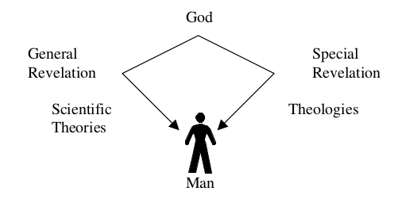

# Appendix K - Christianity and Modern Science

*This section contains excerpts from the **Report of the Creation Study Committee** which may be found at the PCA Position Papers [http://www.pcahistory.org/pca/](http://www.pcahistory.org/pca/)

These excerpts are taken from Appendix C [http://www.pcahistory.org/creation/report.html#d3](http://www.pcahistory.org/creation/report.html#d3).

It is important at this point to distinguish between scientific theories as such and general revelation in its totality. To aid in this we may draw a parallel between scientific theories and theologies in the following diagram:

In the case of special revelation, the same data (Scripture) can give rise to theologies as divergent as Calvinism and Dispensationalism. Likewise in general revelation the same data can produce theories as opposite as Intelligent Design and Neo-Darwinism. Nevertheless, in both general and special revelation God’s truth remains even if the apprehension of it by sinful men clouds and distorts it in their minds. These two “books” of revelation are by the same author.

The first, the book of nature is God’s self-revelation in creation, while the second, the book of Scripture, is God’s self-revelation in redemption. Or as Van Til puts it, “. . . revelation in nature and revelation in Scripture are mutually meaningless without one another, and mutually fruitful when taken together.”

In his treatise on the knowledge of God from the Institutes, Calvin writes:

> There are innumerable evidences both in heaven and on earth that declare his wonderful wisdom; not only those more recondite matters for the closer observation of which astronomy, medicine, and all natural science are intended, but also those which thrust themselves upon the sight of even the most untutored and ignorant persons, so that they cannot open their eyes without being compelled to witness them. Indeed, men who have either quaffed or even tasted the liberal arts penetrate with their aid far more deeply into the secrets of the divine wisdom. Yet ignorance of them prevents no one from seeing more than enough of God’s workmanship in his creation to lead him to break forth in admiration of the Artificer. To be sure, there is need of art and of more exacting toil in order to investigate the motion of the stars, to determine their assigned stations, to measure their intervals, to note their properties. As God’s providence shows itself more explicitly when one observes these, so the mind must rise to a somewhat higher level to look upon his glory.

Here Calvin notes the particular role of the natural sciences inenabling deeper insights into the secret workings of the divine wisdom in order to obtain a brighter view of God’s glory. If this was true in Calvin’s day, think of our own in which both the immensity of the universe (100 billion galaxies each containing 100 billion stars) and the exquisite and complex construction of the microscopic human cell have been uncovered.

For the Christian who has been called to a vocation in the sciences, Calvin’s words are affirmation that one’s labors are helping to expound more fully the content of general revelation, “as the providence of God is more fully unfolded.” In the last century that content has grown enormously through discoveries in physics, astronomy, biology, mathematics and chemistry. In spite of the reigning paradigm of materialistic naturalism, these discoveries attest to the wisdom of a super-intelligent Designer who has mercifully poured out His blessings on His people through the application of these scientific findings in fields such as medicine and engineering. In the realm of philosophy a new movement called “intelligent design” has begun to challenge materialism and neo-Darwinism by focusing on the scientific facts - such as the irreducible complexity of various biological systems. As we make the connection between the Intelligent Designer of general revelation and the Son of God of special revelation, we reaffirm Paul’s statement of Colossians 1:16: “For by him all things were created: things in heaven and on earth, visible and invisible, whether thrones or powers or rulers or authorities; all things were created by him and for him.”

It is important to reaffirm that special revelation teaches there was a creation event and/or events. There was a genesis of space and time. Although the precise interpretation of Genesis 1 & 2 may be debated, there is no debate that God created the universe, and that creation includes the covenant head of the human family, Adam and Eve. In the case of general revelation the story is not so straightforward. Scientific theories and philosophies have waxed and waned all the way from an eternally existing “steady state” universe to the latest cosmological theory known as the Big Bang, which states that the entire universe - including matter, energy, space and time - all came into being from an infinitesimal point in a gigantic explosion about 15 billion years ago. It is tempting for scientists, even Christian scientists, working in a field to adopt the latest theory presumably because the accumulation of data strongly supports it. Yet, as J. P. Moreland points out, the history of science can be interpreted as showing a pattern of replacing one set of theories by an entirely different set. By this reasoning today’s current theory (e.g., the Big Bang) may eventually be replaced by another theory that better explains new discoveries. It is important to note that the scientific discovery, or the “data” with which scientists work (i.e., the things that God has graciously revealed to mankind) have not changed, although more data may become available. It is the interpretation of the data which changes and which will eventually be seen to be totally in accord with special revelation in the Bible. Prior to that eventuality, there is even now a pattern of positive progression in the history of the discoveries themselves. A century ago astronomers had only a vague notion of the size of the universe. Today we have measured its vastness through numerous observations in all regions of the electromagnetic spectrum.

At this point we want to suggest a parallel between what the church confesses about special and general revelation. If there is a parallel, there is a contrast. The canon of special revelation is, for us, fixed; the only parallel to that in general revelation is the entirety of the created realm (which is incomprehensibly big, and only infinitesimally apprehended by man!). If we use Hodge’s analogy, the data of Scripture are the raw material for the construction of theological explanations or positions (theological or scientific) that we identify ourselves by, and insist are true. Thus we identify ourselves by the Creed of Nicea.

In theology, there are gradations of loyalty; the trinity is a core belief, without which a “church” is no church of Christ. Infant baptism is important, and distinguishes us from the Baptists - but the Baptists’ failure to accept that doctrine does not put them outside the true church (it just cuts them off from the blessings enjoyed by those who embrace the doctrine).

When it comes to the church’s position on scientific explanations, there is again a gradation of loyalty. There are some that are simply outside the pale: polygenetic origin of humanity is one, for example; neo-Darwinism (at least in its full metaphysical implication, as discussed in our longer Definitions Appendix) should also be. There are some scientific positions on which the church must take its stand: for example, monogenetic (and special) origin of mankind. On the other hand, there are scientific positions on which the church can say it has no objection to them: for example, non-geocentric cosmology, DNA as the basis of the genetic code. Hence for those theories within the pale, the Christian in science has the privilege of expanding our appreciation for what God has done by explaining how. But further, for those heories that are crucial to Christianity’s truth claims (such as monogenetic origin of mankind), the scientific Christian has the additional task of commending the evidence for them and refuting the speculations that set themselves against them. The class of theories to which the church need have no objection is not a stable one: once, for example, scientists (including Christian ones) subscribed to the phlogiston theory of Chemistry. It would be a mistake to tie the truth of Christianity to the endurance of theories in this class: instead we are happy to let the evidence take us where it seems to lead. It is not always easy to tell whether a given theory is in the class of essentials or of the non-objectionables: at one time some put geocentric cosmology among the essentials.

We know where to put some biological theories of origins. We know this because they take as their starting point a metaphysic that is irreconcilable with Scripture. Precisely the question, then, is where do we put cosmological and geological theories regarding the age of the cosmos and the earth? We have at least two options:

1. to say that our exegesis of Scripture demands that the earth and universe are “young,” so any theories that contradict that must be wrong;

2. to say that our exegesis of Scripture allows a latitude of belief on the age question, so long as the core metaphysics of our faith (such as the idea that the universe has a beginning; God is free to perform miracles according to his purposes; and that the first humans were specially created, and all other humans descend from them) are respected.

Those who take the second option should be careful not to identify their exegesis too closely with specific scientific theories such as the Big Bang.

Clearly there are committed, Reformed believers who are scientists that are on either side of the issue regarding the age of the cosmos. Just as in the days following the Reformation, when the church could not decide between the geocentric and heliocentric views of the solar system, so today there is not unanimity regarding the age question. Ultimately, the heliocentric view won out over the geocentric view because of a vast preponderance of facts favoring it based on increasingly sophisticated observations through ever improving telescopes used by thousands of astronomers over hundreds of years.

Likewise, in the present controversy, a large number of observations over a long period of time will likely be the telling factor. John Mark Reynolds, a young earth creationist, puts it well:

> Presently, we can admit that as recent creationists we are defending a very natural biblical account, at the cost of abandoning a very plausible scientific picture of an “old” cosmos. But over the long term, this is not a tenable position. In our opinion, old earth creationism combines a less natural textual reading with a much more plausible scientific version. They have fewer “problems of science.” At the moment, this would seem to be the more rational position to adopt. Recent creationism must develop better scientific accounts if it is to remain viable against old earth creationism. On the other hand, the reading of Scripture (e.g., a real Flood, meaningful
genealogies, and actual dividing of languages) is so natural hat it seems worth saving. Since we believe recent creation cosmologies are improving, we are encouraged to continue the effort.

As Reynolds notes, it is a continuing effort, not a completed one that we face. Ultimately, the church is not the authoritative source for determining what is or is not scientific truth. Traditionally, this has been left to the scientific community to decide. However, in our generation that scientific community has become progressively more hostile to the truths of special revelation. Thus, the church must be prepared to address the claimed “scientific truths” of the science communities and be prepared to “manage by fact” as the data from the science pours forth. The present day intelligent design movement would appear to be a good example of how the church in the broader evangelical context can be effective in this manner.

**Summary and Conclusions**

The goal of general revelation along with special revelation is to know God, and thus “enjoy Him forever.” He has given us rational minds that are capable of thinking His thoughts after Him, particularly as concerns His creation. Just as the Holy Spirit illuminates our minds as we read His special revelation, so His providence directs the church of Jesus Christ to know the truth of His general revelation. In the knowing, that truth will indeed set us free. Until we know, Christ’s Church must not be divided over what we do not yet know.
